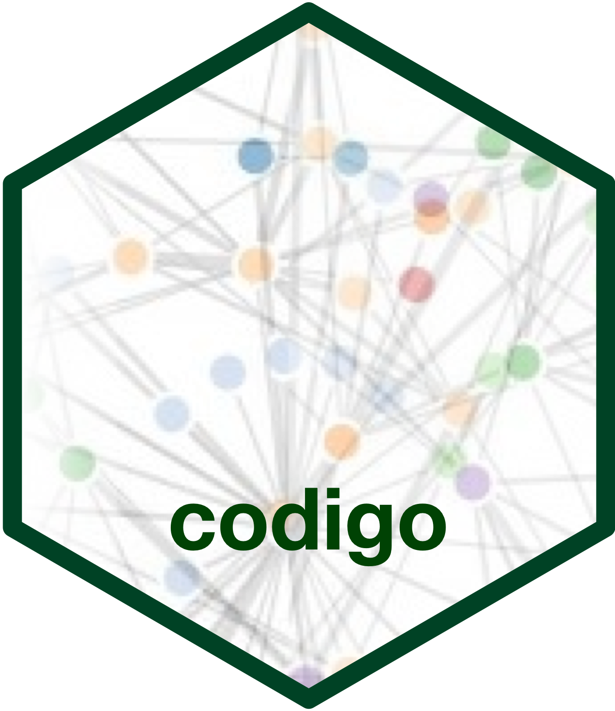

<!-- README.md is generated from README.Rmd. Please edit that file -->

# codigo: Interface to the International Classification of Diseases (ICD) API 

<!-- badges: start -->

[](https://www.repostatus.org/#wip)
[](https://lifecycle.r-lib.org/articles/stages.html#experimental)
[](https://github.com/OxfordIHTM/icd/actions/workflows/R-CMD-check.yaml)
[](https://app.codecov.io/gh/OxfordIHTM/icd?branch=main)
[](https://github.com/OxfordIHTM/icd/actions/workflows/test-coverage.yaml)
[](https://www.codefactor.io/repository/github/oxfordihtm/icd)
<!-- badges: end -->

The [International Classification of Diseases
(ICD)](https://www.who.int/standards/classifications/classification-of-diseases)
serves a broad range of uses globally and provides critical knowledge on
the extent, causes and consequences of human disease and death worldwide
via data that is reported and coded with the ICD. [ICD
API](https://icd.who.int/icdapi) allows programmatic access to the ICD.
It is an HTTP based REST API. This package provides functions that
interface with the ICD API.

## What does `codigo` do?

Please note that `codigo` is still highly experimental and is undergoing
a lot of development. Hence, any functionalities described below have a
high likelihood of changing interface or approach as we aim for a stable
working version.

Currently, the package provides functions for authenticating with the
ICD API. From here, the plan is to develop functions that wrap the
various available [API
endpoints](https://id.who.int/swagger/index.html).

## Installation

`codigo` is not yet on CRAN.

You can install the development version of `codigo` from
[GitHub](https://github.com/OxfordIHTM/codigo) with:

``` r
if(!require(remotes)) install.packages("remotes")
remotes::install_github("OxfordIHTM/codigo")
```

then load `codigo`

``` r
# load package
library(codigo)
```

## Usage

### Authenticating with the ICD API

The ICD API uses OAuth2 for authentication. The package has a set of
utility functions that support the ICD API authentication specifications
leading to the generation of an OAuth2 token. The `icd_oauth_client()`
function is the downstream and user-facing function that creates an ICD
OAuth2 client that can be used for token retrieval by future functions
that wrap ICD API for entity and linearization information retrieval.

An ICD OAuth2 client can be generated as follows:

``` r
icd_oauth_client()
```

This function uses a built in OAuth2 client created for light use and
for purposes of package development and testing.

It is recommended that those intending to use this package for
programmatically performing high volume of calls to the ICD API to
create their own **access keys** (`client id` and `client secret`) using
[these
instructions](https://icd.who.int/docs/icd-api/API-Authentication/).

Then, with your access keys, perform the following commands:

``` r
## Create your own OAuth client ----
my_oauth_client <- icd_oauth_client(
  id = "YOUR_CLIENT_ID",
  token_url = "https://icdaccessmanagement.who.int/connect/token",
  secret = "YOUR_CLIENT_SECRET",
  name = "NAME_OF_YOUR_APP
)
```

This OAuth2 client can now be used to the various functions in the
package that require an OAuth2 client for authentication for making
requests to the ICD API.

### Performing a basic search

The main feature of the ICD API is the ability to search ICD 11
Foundation and ICD 11 Linearization for information regarding an
illness/disease. This feature is captured by the
`icd_search_foundation()` function. For example, if *colorectal cancer*
is the disease of interest and information available from ICD 11 is
needed, the following call can be made:

``` r
icd_search_foundation(q = "colorectal cancer")
```

which gives the following output:

    #> $error
    #> [1] FALSE
    #> 
    #> $errorMessage
    #> NULL
    #> 
    #> $resultChopped
    #> [1] FALSE
    #> 
    #> $wordSuggestionsChopped
    #> [1] FALSE
    #> 
    #> $guessType
    #> [1] 2
    #> 
    #> $uniqueSearchId
    #> [1] "7cfa4170-9a40-421d-8d83-1a78b5c8be03"
    #> 
    #> $words
    #> NULL
    #> 
    #> $destinationEntities
    #> $destinationEntities[[1]]
    #> $destinationEntities[[1]]$id
    #> [1] "http://id.who.int/icd/entity/774170412"
    #> 
    #> $destinationEntities[[1]]$title
    #> [1] "Malignant neoplasms of rectosigmoid junction"
    #> 
    #> $destinationEntities[[1]]$stemId
    #> [1] "http://id.who.int/icd/entity/774170412"
    #> 
    #> $destinationEntities[[1]]$isLeaf
    #> [1] FALSE
    #> 
    #> $destinationEntities[[1]]$postcoordinationAvailability
    #> [1] 0
    #> 
    #> $destinationEntities[[1]]$hasCodingNote
    #> [1] FALSE
    #> 
    #> $destinationEntities[[1]]$hasMaternalChapterLink
    #> [1] FALSE
    #> 
    #> $destinationEntities[[1]]$hasPerinatalChapterLink
    #> [1] FALSE
    #> 
    #> $destinationEntities[[1]]$matchingPVs
    #> $destinationEntities[[1]]$matchingPVs[[1]]
    #> $destinationEntities[[1]]$matchingPVs[[1]]$propertyId
    #> [1] "Synonym"
    #> 
    #> $destinationEntities[[1]]$matchingPVs[[1]]$label
    #> [1] "Colorectal Cancer NOS"
    #> 
    #> $destinationEntities[[1]]$matchingPVs[[1]]$score
    #> [1] 1
    #> 
    #> $destinationEntities[[1]]$matchingPVs[[1]]$important
    #> [1] TRUE
    #> 
    #> $destinationEntities[[1]]$matchingPVs[[1]]$foundationUri
    #> [1] "http://id.who.int/icd/entity/774170412"
    #> 
    #> $destinationEntities[[1]]$matchingPVs[[1]]$propertyValueType
    #> [1] 0
    #> 
    #> 
    #> 
    #> $destinationEntities[[1]]$propertiesTruncated
    #> [1] FALSE
    #> 
    #> $destinationEntities[[1]]$isResidualOther
    #> [1] FALSE
    #> 
    #> $destinationEntities[[1]]$isResidualUnspecified
    #> [1] FALSE
    #> 
    #> $destinationEntities[[1]]$chapter
    #> [1] "02"
    #> 
    #> $destinationEntities[[1]]$theCode
    #> NULL
    #> 
    #> $destinationEntities[[1]]$score
    #> [1] 1
    #> 
    #> $destinationEntities[[1]]$titleIsASearchResult
    #> [1] FALSE
    #> 
    #> $destinationEntities[[1]]$titleIsTopScore
    #> [1] FALSE
    #> 
    #> $destinationEntities[[1]]$entityType
    #> [1] 0
    #> 
    #> $destinationEntities[[1]]$important
    #> [1] FALSE
    #> 
    #> $destinationEntities[[1]]$descendants
    #> list()
    #> 
    #> 
    #> $destinationEntities[[2]]
    #> $destinationEntities[[2]]$id
    #> [1] "http://id.who.int/icd/entity/545664807"
    #> 
    #> $destinationEntities[[2]]$title
    #> [1] "Familial nonpolyposis colorectal cancer"
    #> 
    #> $destinationEntities[[2]]$stemId
    #> [1] "http://id.who.int/icd/entity/545664807"
    #> 
    #> $destinationEntities[[2]]$isLeaf
    #> [1] FALSE
    #> 
    #> $destinationEntities[[2]]$postcoordinationAvailability
    #> [1] 0
    #> 
    #> $destinationEntities[[2]]$hasCodingNote
    #> [1] FALSE
    #> 
    #> $destinationEntities[[2]]$hasMaternalChapterLink
    #> [1] FALSE
    #> 
    #> $destinationEntities[[2]]$hasPerinatalChapterLink
    #> [1] FALSE
    #> 
    #> $destinationEntities[[2]]$matchingPVs
    #> list()
    #> 
    #> $destinationEntities[[2]]$propertiesTruncated
    #> [1] FALSE
    #> 
    #> $destinationEntities[[2]]$isResidualOther
    #> [1] FALSE
    #> 
    #> $destinationEntities[[2]]$isResidualUnspecified
    #> [1] FALSE
    #> 
    #> $destinationEntities[[2]]$chapter
    #> [1] "02"
    #> 
    #> $destinationEntities[[2]]$theCode
    #> NULL
    #> 
    #> $destinationEntities[[2]]$score
    #> [1] 0.5203158
    #> 
    #> $destinationEntities[[2]]$titleIsASearchResult
    #> [1] TRUE
    #> 
    #> $destinationEntities[[2]]$titleIsTopScore
    #> [1] TRUE
    #> 
    #> $destinationEntities[[2]]$entityType
    #> [1] 0
    #> 
    #> $destinationEntities[[2]]$important
    #> [1] FALSE
    #> 
    #> $destinationEntities[[2]]$descendants
    #> list()
    #> 
    #> 
    #> $destinationEntities[[3]]
    #> $destinationEntities[[3]]$id
    #> [1] "http://id.who.int/icd/entity/8113015"
    #> 
    #> $destinationEntities[[3]]$title
    #> [1] "Hereditary nonpolyposis colorectal cancer"
    #> 
    #> $destinationEntities[[3]]$stemId
    #> [1] "http://id.who.int/icd/entity/8113015"
    #> 
    #> $destinationEntities[[3]]$isLeaf
    #> [1] FALSE
    #> 
    #> $destinationEntities[[3]]$postcoordinationAvailability
    #> [1] 0
    #> 
    #> $destinationEntities[[3]]$hasCodingNote
    #> [1] FALSE
    #> 
    #> $destinationEntities[[3]]$hasMaternalChapterLink
    #> [1] FALSE
    #> 
    #> $destinationEntities[[3]]$hasPerinatalChapterLink
    #> [1] FALSE
    #> 
    #> $destinationEntities[[3]]$matchingPVs
    #> list()
    #> 
    #> $destinationEntities[[3]]$propertiesTruncated
    #> [1] FALSE
    #> 
    #> $destinationEntities[[3]]$isResidualOther
    #> [1] FALSE
    #> 
    #> $destinationEntities[[3]]$isResidualUnspecified
    #> [1] FALSE
    #> 
    #> $destinationEntities[[3]]$chapter
    #> [1] "02"
    #> 
    #> $destinationEntities[[3]]$theCode
    #> NULL
    #> 
    #> $destinationEntities[[3]]$score
    #> [1] 0.5075196
    #> 
    #> $destinationEntities[[3]]$titleIsASearchResult
    #> [1] TRUE
    #> 
    #> $destinationEntities[[3]]$titleIsTopScore
    #> [1] TRUE
    #> 
    #> $destinationEntities[[3]]$entityType
    #> [1] 0
    #> 
    #> $destinationEntities[[3]]$important
    #> [1] FALSE
    #> 
    #> $destinationEntities[[3]]$descendants
    #> list()

The output is a list parsed from the JSON body text of the HTTP response
from the ICD API. This output can then be further processed by the user
for their intended end use.

## Citation

If you find the `codigo` package useful please cite using the suggested
citation provided by a call to the `citation()` function as follows:

``` r
citation("codigo")
#> To cite icd in publications use:
#> 
#>   Anita Makori and Ernest Guevarra (2024). icd: Interface to the
#>   International Classification of Diseases (ICD) API. R package version
#>   0.0.9000. URL https://oxford-ihtm.io/icd/
#> 
#> A BibTeX entry for LaTeX users is
#> 
#>   @Manual{,
#>     title = {icd: Interface to the International Classification of Diseases (ICD) API},
#>     author = {{Anita Makori} and {Ernest Guevarra}},
#>     year = {2024},
#>     note = {R package version 0.0.9000},
#>     url = {https://oxford-ihtm.io/icd/},
#>   }
```

## Community guidelines

Feedback, bug reports and feature requests are welcome; file issues or
seek support [here](https://github.com/OxfordIHTM/codigo/issues). If you
would like to contribute to the package, please see our [contributing
guidelines](https://oxford-ihtm.io/codigo/CONTRIBUTING.html).

This project is released with a [Contributor Code of
Conduct](https://oxford-ihtm.io/codigo/CODE_OF_CONDUCT.html). By
participating in this project you agree to abide by its terms.
